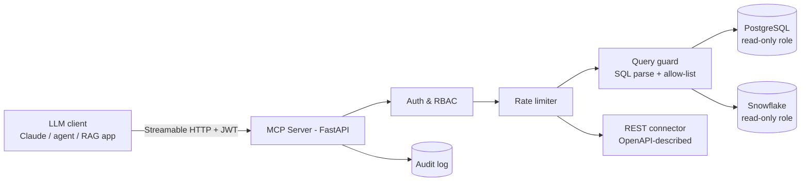

# Unified Enterprise MCP Server

**One remote Model Context Protocol server that gives LLM agents safe, typed, audited access to PostgreSQL, Snowflake and internal REST APIs.**

> **Status: active development.** The design and security model below are fixed. Implementation is in progress (see [Roadmap](#roadmap)). Benchmarks are reported only once measured.

---

## Problem

Teams wiring LLM agents into company data usually end up with one of two bad options:

- **Raw database credentials in the agent.** The model can write `DROP TABLE` and nothing structural stops it.
- **A dozen bespoke tool wrappers.** Each has its own auth, logging and schema docs. The tool descriptions alone eat a large share of the context window.

MCP standardises how agents discover and call tools. The hard part is the **server**: authentication, authorisation, query safety, rate limits and auditability, all while keeping the tool surface small enough that the model can actually use it.

## What it does

- Exposes a **small set of typed, parameterised Tools** (e.g. `run_readonly_query`, `describe_table`, `search_tables`, `call_api_endpoint`) instead of one tool per table or endpoint.
- Exposes **read-only Resources** for schemas and API specs, so the client fetches them on demand instead of stuffing them into the prompt.
- Enforces safety in the server, never in the prompt:
  - **AuthN:** JWT bearer tokens (OAuth 2.1-style resource server), validated on every request
  - **AuthZ:** role → allowed data sources, schemas and tools
  - **Query guard:** SQL is parsed (sqlglot) and only allow-listed statement types are accepted (`SELECT`, `WITH`, `EXPLAIN`). DDL and DML are rejected *before* reaching the database. Every query runs on a read-only connection with a statement timeout and a row cap.
  - **Rate limiting:** a per-user, per-tool token bucket
  - **Audit log:** every call recorded as structured JSON (who, which tool, arguments hash, decision, latency, row count)

## Architecture



## Tools and resources

| Kind | Name | Purpose |
|---|---|---|
| Tool | `search_tables(query)` | Find relevant tables or columns across sources by name or description |
| Tool | `describe_table(source, table)` | Columns, types, keys, sample rows (masked) |
| Tool | `run_readonly_query(source, sql, limit)` | Guarded SQL execution with a row cap |
| Tool | `call_api_endpoint(service, operation_id, params)` | Call an allow-listed REST operation from an OpenAPI spec |
| Resource | `schema://{source}/{schema}` | Full schema documentation, fetched on demand |
| Resource | `openapi://{service}` | API spec for allow-listed services |

## Security test suite

`tests/security/` is a red-team suite that runs in CI. It checks the guard, not the model:

- Destructive statements: `DROP`, `DELETE`, `TRUNCATE`, `UPDATE`, `ALTER`, `GRANT`
- Evasion attempts: stacked queries (`SELECT 1; DROP ...`), comments, CTE-wrapped DML, case and whitespace tricks, `COPY`/`UNLOAD`, function calls with side effects
- AuthZ: a role querying a source or schema it isn't granted
- Rate-limit and token-expiry behaviour

## Evaluation plan

| Metric | How it's measured |
|---|---|
| Destructive-query block rate | Share of the red-team suite rejected before reaching the DB |
| Tool latency (P50/P95) | Load test with recorded agent traces (locust) |
| Tool-discovery context cost | Tokens in the `tools/list` + needed resources payload vs a naive one-tool-per-table design |
| Agent task success | Fixed set of natural-language data questions answered correctly via the server |

## Results

| Metric | Value |
|---|---|
| Destructive-query block rate | – |
| P95 tool latency | – |
| Tool-discovery tokens (this design vs naive) | – |
| Task success on question set | – |

*Populated from `bench/reports/` once measured.*

## Tech stack

Python 3.11 · MCP Python SDK (Streamable HTTP) · FastAPI · PostgreSQL (asyncpg) · Snowflake connector · sqlglot · PyJWT · Docker / docker-compose · pytest · locust

## Installation

```bash
git clone https://github.com/RoopanshuSD/unified-data-mcp-server.git
cd unified-data-mcp-server
cp .env.example .env              # DB DSNs, JWT public key, role map
docker compose up -d              # server + sample Postgres with seed data
```

## Usage

```bash
# issue a dev token for role "analyst"
python scripts/dev_token.py --role analyst

# connect from any MCP client, e.g. the MCP Inspector
npx @modelcontextprotocol/inspector http://localhost:8000/mcp

# run the security suite
pytest tests/security -q
```

## Roadmap

- [ ] M1: MCP server skeleton with `describe_table` / `run_readonly_query` on Postgres
- [ ] M2: SQL guard (sqlglot) + red-team test suite
- [ ] M3: JWT auth, role map, token-bucket limiter, audit log
- [ ] M4: Snowflake + REST (OpenAPI) connectors, schema Resources
- [ ] M5: Load test, context-cost measurement, agent question-set eval

## Limitations

- SQL parsing guards cannot catch every dialect-specific side effect. The read-only DB role is the real safety net, and the guard is defence in depth.
- Row masking is column-name based in v1, not data-classification based.

## References

- Model Context Protocol specification and Python SDK, modelcontextprotocol.io
- OWASP Top 10 for LLM Applications: prompt injection, excessive agency
- sqlglot: SQL parser and transpiler

## License

MIT
