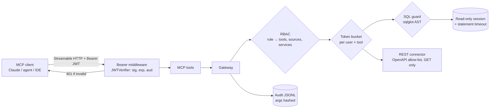

# Unified Data MCP Server

**One remote [Model Context Protocol](https://modelcontextprotocol.io) server that gives LLM agents typed, audited, read-only access to SQL databases (SQLite, PostgreSQL, Snowflake) and allow-listed REST APIs. Safety is enforced in the server, not in the prompt.**

```bash
pip install -e ".[dev]"
python scripts/make_demo_data.py          # demo sources: shop (12 tables) + hr (restricted)
pytest -q                                 # 92 tests: red-team suite, RBAC, auth, rate limits, REST allow-list, MCP layer
python -m bench.run_bench                 # reproduces the table below
```

---

## Why

Connecting agents to company data usually ends one of two ways:

- **The agent holds raw DB credentials.** Nothing structural stops `DROP TABLE`, `pg_read_file('/etc/passwd')` or a 30-second `pg_sleep`.
- **A tool per table or endpoint.** Every tool needs its own auth and logging, and the tool list eats the context window.

MCP standardises discovery and calling. The hard part is the **server**: who is calling, what they may touch, which SQL is acceptable, how fast, and what gets recorded. This repo implements that layer.

## Results (measured; reproduce with `python -m bench.run_bench`)

| Metric | Result |
|---|---|
| Red-team attacks blocked by the SQL guard | **48/48** across 13 categories |
| Benign analyst queries wrongly rejected | **0/18** |
| Tool latency, end-to-end in-process (SQLite), 2,000 calls | P50 1.43 ms · P95 2.51 ms |
| SQL guard alone (parse + AST checks) | P50 0.45 ms |
| `tools/list` size: this server vs one-tool-per-table (14 tables) | 5 tools / **784 tokens** vs 14 tools / 1,368 tokens |

**How to read these numbers**

- **Red-team:** [`tests/security/redteam_cases.yaml`](tests/security/redteam_cases.yaml) covers DDL/DML, privilege and session changes (`SET ROLE`, `set_config`), stacked queries, comment and case evasion, **data-modifying CTEs** (`WITH d AS (DELETE … RETURNING *) SELECT …`), `SELECT INTO`, file and network exfiltration (`COPY`, `pg_read_file`, `dblink`, `ATTACH`, `load_extension`), DoS (`pg_sleep`, `pg_terminate_backend`), row locking, and sensitive catalogs, across Postgres, SQLite and Snowflake dialects. The benign set deliberately includes queries with `DROP`, `DELETE` and `;` *inside string literals*. I wrote this suite myself alongside the guard, so it shows the guard covers these known patterns. It does not prove the guard is complete, which is why the read-only DB session (below) is the real safety net.
- **Latency** is measured in-process, so it shows the server's overhead (RBAC + rate limit + guard + query + audit) on small SQLite tables. It is **not** a deployed network latency.
- **Context cost** is counted with `tiktoken` `cl100k_base` as a model-agnostic approximation. The naive baseline is one `query_<table>` tool per table with its columns in the description. This design keeps 5 generic tools and serves schemas on demand via the `schema://{source}` resource, so the tool list stays the same size as tables are added.

## Architecture



**Defence in depth, in order:**
1. **Authentication** ([`auth.py`](unified_mcp/auth.py)): the server is an OAuth 2.1 *resource server*. The MCP SDK's bearer middleware calls `JWTVerifier` on every HTTP request, checking signature, `exp`, and that `aud` equals this server. Tools read the verified principal from the request context, so a missing or invalid token gets a 401 before any tool runs.
2. **Authorization** ([`gateway.py`](unified_mcp/gateway.py)): each role maps to allowed tools, data sources and REST services ([`config.yaml`](config.yaml)). `analyst` cannot see the `hr` source or even discover its tables.
3. **Rate limiting** ([`ratelimit.py`](unified_mcp/ratelimit.py)): a token bucket per (user, tool) that returns `retry_after_s`.
4. **SQL guard** ([`guard.py`](unified_mcp/guard.py)): parse with sqlglot, require exactly one statement whose root is a `SELECT` or set operation, walk the whole AST and reject any write/DDL/session/command node, deny-listed functions and sensitive catalog tables, then wrap the query in an outer `LIMIT` row cap.
5. **Read-only execution** ([`connectors.py`](unified_mcp/connectors.py)): SQLite opens with `mode=ro` plus a progress-handler timeout; Postgres uses `SET SESSION CHARACTERISTICS AS TRANSACTION READ ONLY` plus `statement_timeout`; Snowflake uses a SELECT-only role plus `STATEMENT_TIMEOUT_IN_SECONDS`. **This is the real safety net, and the guard is defence in depth.**
6. **Audit** ([`audit.py`](unified_mcp/audit.py)): every call is appended as JSONL (subject, role, tool, decision, reason, latency, row count). Arguments are stored as a **SHA-256 hash**, because queries contain customer literals.

## Tools and resources

| Kind | Name | Purpose |
|---|---|---|
| Tool | `search_tables(query)` | Find tables across the sources *you* can access |
| Tool | `describe_table(source, table)` | Columns, types, primary and foreign keys, row count |
| Tool | `run_readonly_query(source, sql, limit)` | One guarded `SELECT`, row-capped |
| Tool | `list_api_operations()` | REST operations you may call (from OpenAPI) |
| Tool | `call_api_endpoint(service, operation_id, params)` | Call an allow-listed operation; GET-only by default; unknown params rejected |
| Resource | `schema://{source}` | Full schema document, fetched on demand |

All tools carry MCP annotations (`readOnlyHint`, `idempotentHint`), so clients can skip confirmation prompts safely.

## Run it

```bash
export MCP_JWT_SECRET=$(python -c "import secrets; print(secrets.token_urlsafe(32))")
python -m unified_mcp.server --config config.yaml        # Streamable HTTP on http://localhost:8000/mcp
python scripts/dev_token.py analyst                      # bearer token for the "analyst" role

# inspect with the MCP Inspector (add the header Authorization: Bearer <token>)
npx @modelcontextprotocol/inspector
```

To add a real database, uncomment a `postgres` or `snowflake` source in `config.yaml` and install the extra (`pip install -e ".[postgres]"`). For Postgres, `docker compose up -d` plus `DATABASE_URL=… pytest tests/integration` runs a test proving that **the session rejects writes even when the guard is bypassed**.

## Tests (92 passing, 2 integration tests skipped without a database)

| File | Covers |
|---|---|
| `tests/security/test_guard_redteam.py` | All 48 attacks blocked, all 18 benign queries allowed, row-cap wrapping |
| `tests/test_gateway.py` | Benign queries execute on the demo DB; RBAC by source and tool; unauthenticated rejection; FK discovery; per-user rate limits; audit hashing |
| `tests/test_auth_ratelimit_rest.py` | JWT valid / expired / wrong audience / wrong key / garbage; bucket refill; REST allow-list, method block, missing and unknown params |
| `tests/test_server.py` | MCP tool list and annotations; tools act as the token's principal; no token means unauthenticated |
| `tests/integration/test_postgres.py` | Read-only session enforcement on real Postgres (requires `DATABASE_URL`) |

## Limitations

- **The guard is pattern coverage, not proof.** Dialect-specific side effects can exist that sqlglot parses as a plain `SELECT` (e.g. a user-defined function with side effects). The read-only session or role is what actually prevents writes.
- **Postgres and Snowflake connectors are not yet exercised in CI.** The Postgres integration test exists and runs with `DATABASE_URL`; Snowflake needs an account.
- **Row masking is not implemented yet.** Column-level PII masking by data classification is on the roadmap.
- **Latency numbers are in-process SQLite**, not a networked deployment.

## Roadmap

- [x] Guard + red-team suite, RBAC, JWT resource-server auth, rate limiting, hashed audit log
- [x] SQLite / Postgres / Snowflake connectors, OpenAPI REST connector, schema resource
- [ ] Postgres integration test in CI (service container)
- [ ] Column-level PII masking from a data-classification map
- [ ] Agent task-success eval: a fixed set of natural-language data questions answered through the server
- [ ] Load test over HTTP (locust) for networked P50/P95

## References

- Model Context Protocol specification: tools, resources, authorization for remote servers
- OWASP Top 10 for LLM Applications: prompt injection, excessive agency
- [sqlglot](https://github.com/tobymao/sqlglot): SQL parser and transpiler

## License

MIT
